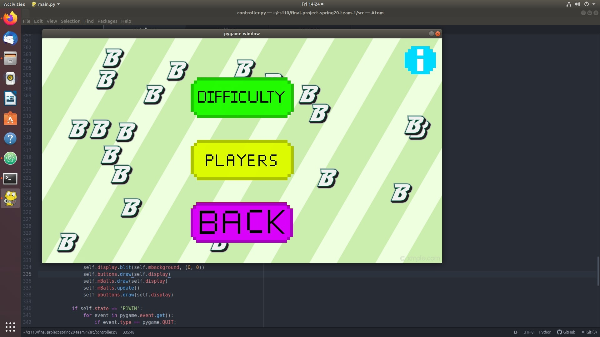
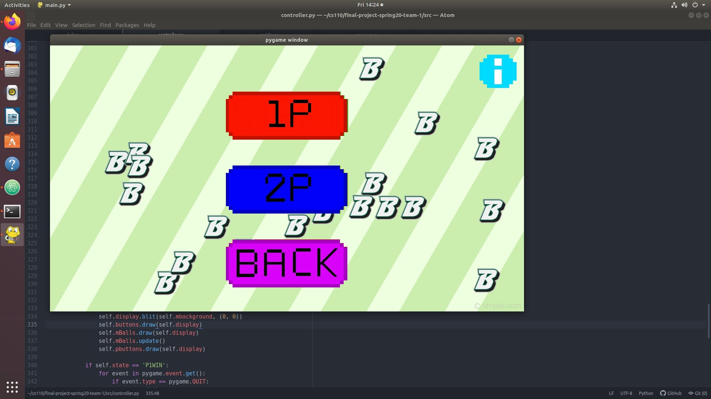
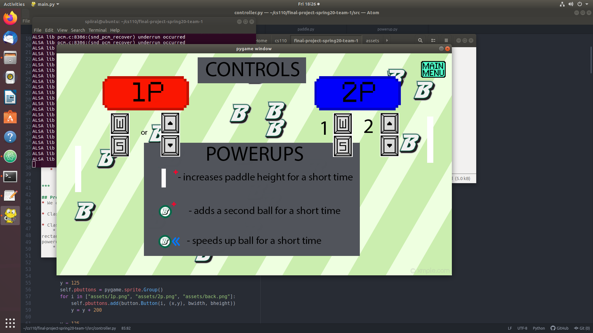
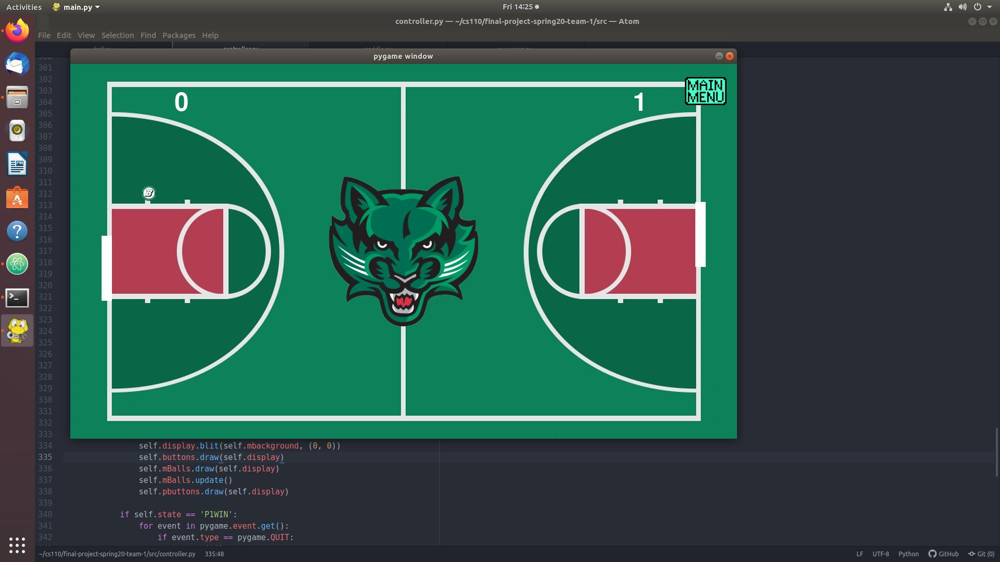
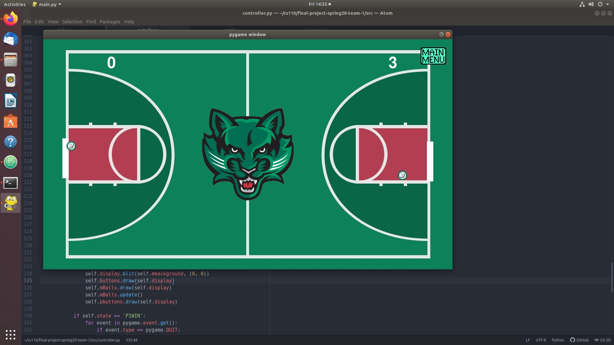
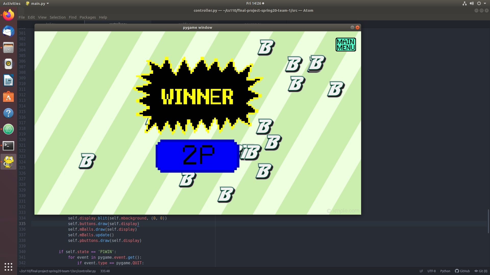
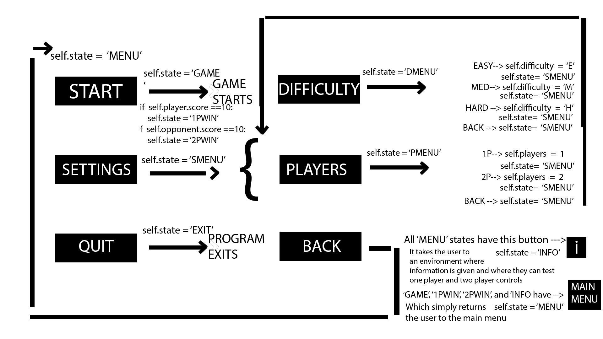
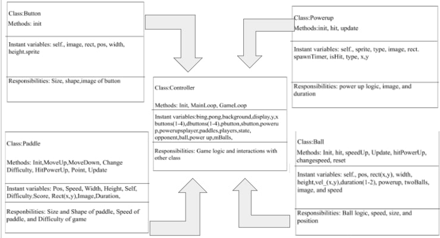

# Bing Pong
## :warning: CS 400 Final Project :warning:
### Winter 2024
### [Assignment Description](https://drive.google.com/open?id=1HLIk-539N9KiAAG1224NWpFyEl4RsPVBwtBZ9KbjicE)

https://github.com/buscs110/final-project-spring20-team-1

https://drive.google.com/open?id=1C9DhDNxPOTwonTbN3xBtvtzHAAr6x_Joah4TxxUYEDE

 Kaseem Thomas

***

## Project Description
My project is a simple pingpong game with Binghamton accents all over presented by the logos and colors. It represents an arcade-style pingpong game with paddles, the ball and the "table" represented by the borders. The game keeps score, has difficulty levels, which changes the ball speed or the size of the paddle, has powerups and the capability to have 2 players. 

***    

## User Interface Design
* User Interface
    * 
    The first menu screen gives the user the option to start the game with the default settings, edit the settings themselves, or quit the game. 
    * 
    Clicking settings will lead you to this screen, in which you can choose to edit the difficulty, set the number of players, or return to the main menu.
    * 
    Upon pressing difficulty, the user is then prompted to choose easy, medium, or hard. They also have the option to return to the settings menu.
    * 
    If the user presses the players button, they are sent to a menu where they can choose between one or two players, or return to the settings menu.
    * 
    If in any of the above menus the user presses the blue 'i' button, they will be sent here, where they can learn relevant information about the game and test out the paddle controls for 1 player mode and 2 player mode.
    * 
    Once the user decides they are ready to play, pressing start will begin the game. If they chose to play by themselves, the opponent will be automated. Depending on what difficulty the user chose, the paddles can range from small to large and the ball speed can range from slow to fast. The user can at any time press the main menu button to return to the main menu.
    * 
    During the course of the game, powerups will appear every 20 seconds. There are 3 types of powerups. Type 1 increases ball speed, type 2 increases the size of the paddle that the ball hit last, and type 3 adds another ball. Type 3 is shown in the image.
    * 
    Once one of the players reaches 10 points, the appropriate win screen is deployed. The user can then press the main menu button to return to the main menu.
    
    
   A diagram outlining the GUI
   * 
   

***        

## Program Design
* I only used the Pygame library.
    
* Class Interface Design
        * 
* Classes
    * Paddle: Created the paddles by establishing length and width of the rectangle. Giving it code to sense collision of the ball, interact with powerups and interact with difficulty changing its length.
    * Ball: Created Ping Pong by establishing the speed of the ball and the size of the ball. Interacting with difficulty by changing the speed of the ball.
    * Controller: Where the majority of the code was implemented to combine all classes and methods into a game.
    * Table: Not necessarily a table, but created the background image and set borders where the ball can't go outside the scren.
    * Opponent: Created an opponent for the player with set motions to imitate what a player would do. 
    * Player: Establishing user-input to be able to move the paddle with keys like "WASD" or the arrows. 
    

***

 

## Testing

* .jpg)
* .jpg)
